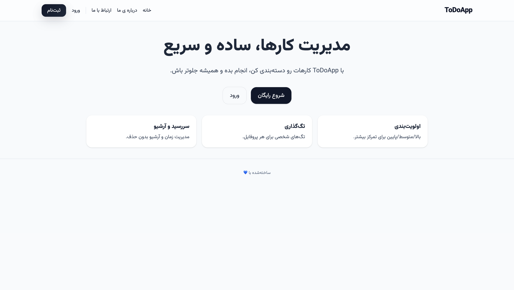
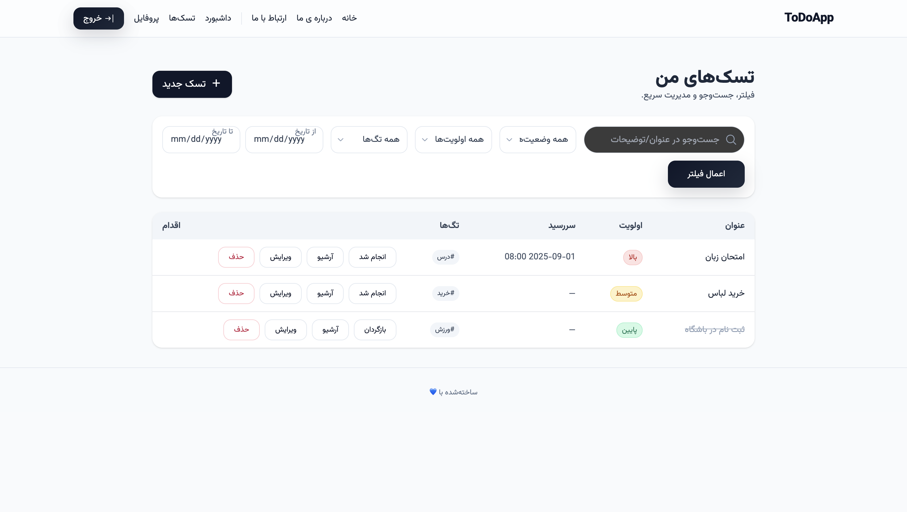
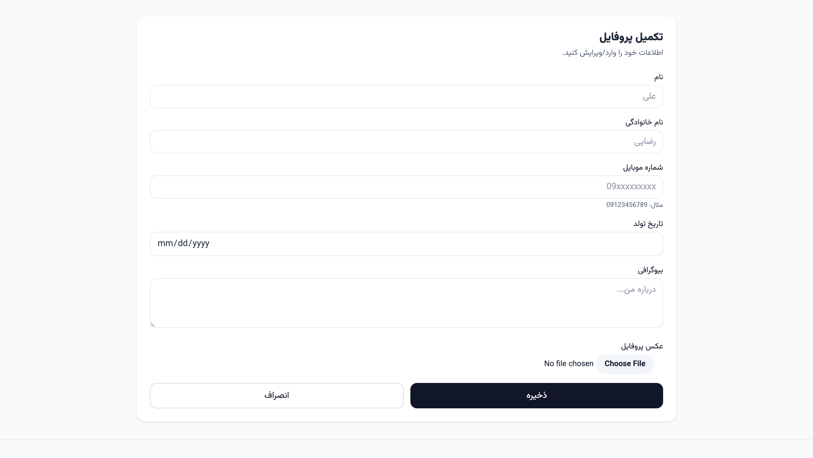

# 📝 ToDoApp – Task Management with Django & Tailwind

A modern and complete **ToDoApp** built with **Django**, **PostgreSQL**, and **TailwindCSS** ✨. The **UI is fully responsive** and designed with **RTL support** – the site interface is in **Persian (Farsi)** 🇮🇷, offering a localized experience for Persian-speaking users.

---

## 🚀 Features

- Login & Signup using **email** instead of username 🔐
- User profile with avatar, phone number, and birth date 🧑‍💼
- Create, edit, delete, and archive tasks ✅
- Advanced filtering by status, tag, and date 📅
- Full **Persian** language support (RTL layout)
- **Responsive design** for mobile & desktop 📱💻

---

## 📸 Screenshots of Important Pages

| Page             | Image |
| ---------------- | ----- |
| **Home Page**    | |
| **Tasks Page**   | |
| **Profile Page** | |
| **Login Page**   | |

---

## 📂 Project Structure

```
core/
│   manage.py
│
├── core/              # Main Django settings
├── accounts/          # Authentication & user profile app
├── todos/             # Tasks, tags, and attachments management app
└── templates/         # HTML templates styled with TailwindCSS
```

---

## ⚙️ Installation & Setup

### 1️⃣ Clone the repository

```bash
git clone https://github.com/alirezaaizy/ToDoApp.git
cd ToDoApp
```

### 2️⃣ Create `.env` file

```env
DJANGO_SECRET_KEY='your_secret_key'
DJANGO_DEBUG=1
ALLOWED_HOSTS=localhost,127.0.0.1
CSRF_TRUSTED_ORIGINS=http://localhost:8000,http://127.0.0.1:8000

POSTGRES_DB=appdb
POSTGRES_USER=appuser
POSTGRES_PASSWORD=apppass
POSTGRES_HOST=db
POSTGRES_PORT=5432

DJANGO_ENV=dev
DJANGO_COLLECTSTATIC=0
RUN_MIGRATIONS=0
```

### 3️⃣ Run with Docker Compose

```bash
docker compose up --build
```

### 4️⃣ Apply migrations & create superuser

```bash
docker compose exec web python manage.py migrate
docker compose exec web python manage.py createsuperuser
```

---

## ⭐ Support & License

If you found this project useful, please give it a ⭐ on GitHub to support development!

This project is licensed under the **MIT License** – feel free to use and modify it.

